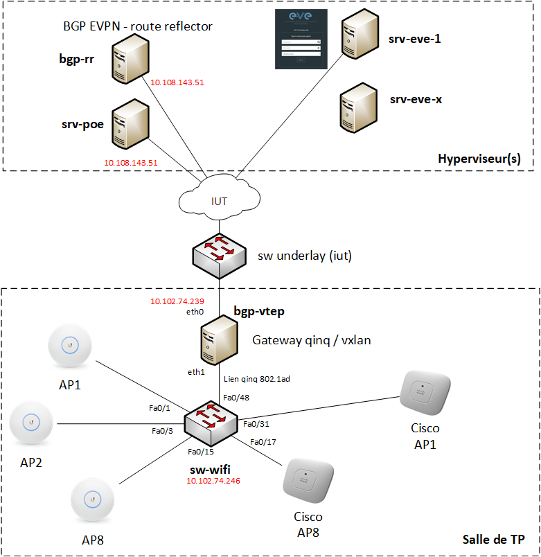

# LabAsService
Virtualisez vos lab wifi !

## Pour commencer

Ce projet décrit la mise en oeuvre d'une infratructure permettant d'accéder à des point d'accès wifi dans une topologie virtuelle.

## Ressources logicielles :

* [Debian 11](https://www.debian.org) -  VXLAN Tunnel End Point
* [FRRouting](https://frrouting.org) - Plan de contrôle de l'infrastructure VXLAN - BGP EVPN
* [Environnement de virtualisation - EVE-NG](https://www.eve-ng.net/)

## Ressources matérielles :
* [Switch Cisco WS-C3750-48PS-S](https://www.cisco.com/c/en/us/products/switches/catalyst-3750-series-switches/datasheet-listing.html) - 137 euros d'occasion
* [adaptateur USB3 -> ethernet]() - mettre la référence
* [PC générique]

### Pré-requis

Il convient tout d'abord câbler l'infrastrucure globale :

- Les points d'accès wifi
- le serveur bgp-vtep 

Dans votre datacenter préféré vous pouvez provisionner les machines :
- srv-poe (Debian 11)
- bgp-rr (Debian 11)

### Installation

Les étapes pour installer votre programme....

Dites ce qu'il faut faire...

_exemple_: Executez la commande ``telnet mapscii.me`` pour commencer ensuite [...]

Ensuite vous pouvez montrer ce que vous obtenez au final...

## Auteurs
Listez le(s) auteur(s) du projet ici !
* **Julien HOARAU** _alias_ [netacy](https://github.com/netacy)

