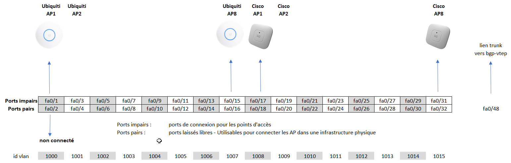

# LabAsService
Virtualisez vos lab wifi !!!

## Pour commencer

Ce projet décrit la mise en oeuvre d'une infratructure permettant d'accéder à des point d'accès wifi dans une topologie virtuelle.


## Ressources logicielles :

* [Debian 11 en machine virtuelle](https://www.debian.org) 
* [Eventuellent Debian 11 sur une machine physique](https://www.debian.org) pour bgp-vtep
* [Environnement de virtualisation - EVE-NG](https://www.eve-ng.net/) (version Community Edition 5.0.1-19 à la date de rédaction)

## Ressources matérielles :
* [Switch Cisco WS-C3750-48PS-S](https://www.cisco.com/c/en/us/products/switches/catalyst-3750-series-switches/datasheet-listing.html) - 137 euros d'occasion
* En fait n'importe quel swith compatible 802.1ad fera l'affaire (nous utilisons en production un switch DELL EMC Networking N1548P)

* [adaptateur USB3 -> ethernet](https://www.edimax.com/edimax/merchandise/merchandise_detail/data/edimax/fr/network_adapters_usb_adapters/eu-4306/) 


* [PC générique] pour la machine bgp-vtep
 
### Infrastructure globale

L'infrastructure globale est la suivante : 


On va donc se préocuper de tout ce petit monde, soit au minimum :
- 3 VMs
- 1 machine physique : bgp-vtep
- 1 switch : sw-wifi
- 16 AP wifi : 8 Cisco et 8 Ubiquiti

Dans votre hyperviseur préféré vous pouvez provisionner les 3 machines :
- srv-poe en (Debian 11)
- bgp-rr en (Debian 11)
- srv-eve-1 (5.0.1-19-Community) : Le machines EVE peuvent également être excetutées avec VMWare Workstation sur les postes des étudiants. 

Attribuez une adresse IP fixe à chacune des machines et assurez vous qu'elles accèdent bien à Internet.

- La machine bgp-vtep doit être déployée à proximité géographique de sw-wifi. Vous pouvez installer Debian 11 directement dessus ou dans une VM. Si vous avez décidé d'utiliser une VM pour cette machine, assurez vous d'avoir un contrôleur USB3 dans les paramètres de virtualisation, et de connecter l'adaptateur USB/Ethernet dans la VM et non dans l'hôte.

### Trafic à autoriser 
- srv-poe <-> sw-wifi  = UDP port 161 (SNMP)
- srv-poe <-> pc étudiant d'une salle de TP  = TCP port 80 (WEB)
- bgp-vtep <-> srv-eve = UDP port 4789 (flux data vxlan)
- bgp-vtep <-> bgp-rr  = TCP 179 (échanges de routes BGP)
- Pour le temps des processus d'installation, les machines doivent pouvoir résoudre des noms et accèder à Internet

### Installation 1/6 : sw-wifi
Comment évoqué, nous allons déployer 8 points d'accès (AP) Cisco et 8 AP Ubiquiti. Nous proposons la disposition suivante :



Remarques :
- chaque access point (AP) est cloisonné dans un vlan client (ici vlans 1000 à 1015)
- un point d'accès pourra faire transiter sur son lien filaire des trames 802.1q 
- on retrouvera sur le lien trunk des trames doublement taguées 802.1ad
- les ports impairs sont utilisé pour connecter les APs : On activrea (ou pas) le POE sur ces ports
- les ports pairs ne sont pas connecté et sont réservé pour pouvoir connecter les APs dans des infrascrtutures physiques. Pas de POE sur ces ports.
 
Un exemple de configuration est disponible [ici](nodes/sw-wifi/config.txt). Il conviendra d'adapter l'adresse IP de management et les identifiants de connexion SNMP et personnalisant un peu ces valeurs...

### Installation 2/6 : srv-poe
Si ce n'est déjà fait, configurez l'interface réseau avec une IP fixe en éditant le fichier ``/etc/network/interfaces``

Passez ensuite à l'installation des dépendances :
```bash
apt update
apt install git
git clone https://www.github.com/netacy/LabAsService
```

```bash
cd ./LabAsService
./install.sh srv-poe
```
Le service web déployé permet de piloter l'état des port POE (les ports impairs) de sw-wifi.
Vous devez modifier le fichier ``/var/www/html/config.php`` pour adapter le dashboard en fonction des équipements que vous déployez rééllement.

**Paramétrage**

Via le protovole SNMP, srv-poe va éteindre/allumer les ports de connexion des équipements wifi. Il convient d'identifier la références des ports dans lors d'une intérogation de sw-wifi.
Ex :
```bash
root@debian:/var/www/html# snmpwalk -v 3 -u userWifi -l authNoPriv -a md5 -A passWifi 10.102.74.230 1.3.6.1.2.1.2.2.1.7
```
```
iso.3.6.1.2.1.2.2.1.7.1 = INTEGER: 1
iso.3.6.1.2.1.2.2.1.7.10001 = INTEGER: 1
iso.3.6.1.2.1.2.2.1.7.10002 = INTEGER: 1
iso.3.6.1.2.1.2.2.1.7.10003 = INTEGER: 1
iso.3.6.1.2.1.2.2.1.7.10004 = INTEGER: 1
iso.3.6.1.2.1.2.2.1.7.10005 = INTEGER: 1
iso.3.6.1.2.1.2.2.1.7.10006 = INTEGER: 1
```

Dans cet exemple, nous voyons que les ports FastEthernet0/1, FastEthernet0/2, etc sont associés aux identifiants 10001, 10002, etc.(justification ???). Nous considérerons par la suite qu'il y a un décalage (offset) de 10000 entre les références de port utilisées par SNMP et les références classiquement utilisées dans les configuration en CLI.

Le fichier `config.php` permet de construire l'interface web et défini également les paramètres techniques pour le pilotage de sw-wifi.
Dans ce fichier modifiez les variables :

- $USER      : utilisateur snmp pour l'intérrogation de sw-wifi
- $PASSWORD  : mot de passe snmp pour l'intérrogation de sw-wifi

- $HOSTS : Tableau associatif qui permet de définir l'adresse IP de sw-wifi, l'OID pour piloter/lister l'état des ports et définir la valeur d'offset. Au besoin, cette variable permet de définir l'existence de plusieurs commutateurs.

- $NODES : Permet de déclarer les points d'accès, les grouper par type, de les associer à un commutateur particulier et de définir le numéro de port physique utilisé par chaque AP.

**Extrait fichier config.php**

```php
<?php
$USER = "userWifi";     // changer
$PASSWORD = "passWifi"; // changer

$HOSTS = [
	'sw_wifi' => [ 	
        'ip' => "10.102.74.230", // changer
        'oidState' => ['1.3.6.1.2.1.2.2.1.7'],	  // AdminStatus, doit convenir quelque soit le modèle de sw
        'valueOn' => "1",
        'portOffset' => 0],
];

$NODES = [
	'Points d\'accès Ubiquiti' => [ // adapter
    'AP1' => ['parent' => 'sw_wifi', 'port' => 1], // adapter
    'AP2' => ['parent' => 'sw_wifi', 'port' => 3],
    'AP3' => ['parent' => 'sw_wifi', 'port' => 5],
    'AP4' => ['parent' => 'sw_wifi', 'port' => 7],
    'AP5' => ['parent' => 'sw_wifi', 'port' => 9],
    'AP6' => ['parent' => 'sw_wifi', 'port' => 11],
    'AP7' => ['parent' => 'sw_wifi', 'port' => 13],
    'AP8' => ['parent' => 'sw_wifi', 'port' => 15],    
	],
	'Points d\'accès Cisco' => [
    'LAP1' => ['parent' => 'sw_wifi', 'port' => 17],
    'LAP2' => ['parent' => 'sw_wifi', 'port' => 19],
    'LAP3' => ['parent' => 'sw_wifi', 'port' => 21],	
    'LAP4' => ['parent' => 'sw_wifi', 'port' => 23],
    'LAP5' => ['parent' => 'sw_wifi', 'port' => 25],
    'LAP6' => ['parent' => 'sw_wifi', 'port' => 27],
    'LAP7' => ['parent' => 'sw_wifi', 'port' => 29],
    'LAP8' => ['parent' => 'sw_wifi', 'port' => 31],    
	],
];
?>
```


Depuis la console de votre switch POE vous devriez visualiser les notifications up/down lorsque vous manipulez l'interface web :
```bash
Switch#
*Jun 19 20:34:26.003: %SYS-5-CONFIG_I: Configured from 10.108.133.251 by snmp
Switch#
*Jun 19 20:34:28.003: %LINK-3-UPDOWN: Interface Ethernet3/1, changed state to up
Switch#
*Jun 19 20:34:30.019: %LINEPROTO-5-UPDOWN: Line protocol on Interface Ethernet3/1, changed state to up
```
### Installation 3/6 : bgp-rr
Si ce n'est déjà fait, configurez l'interface réseau avec une IP fixe en éditant le fichier ``/etc/network/interfaces``

Passez ensuite à l'installation des dépendances :
```bash
apt update
apt install git
git clone https://www.github.com/netacy/LabAsService
```

```bash
cd ./LabAsService
./install.sh bgp-rr
```

Notez bien l'adresse IP de ce serveur bgp-rr (rr = route reflector), nous en aurons besoin pour la suite.
Dans notre cas @IP RR = 10.108.143.51

### Installation 4/6: bgp-vtep
Commencez par configurer l'interface eth0 avec une IP fixe (ou DHCP) en éditant le fichier ``/etc/network/interfaces``


Passez ensuite à l'installation des dépendances :
```bash
apt update
apt install git
git clone https://www.github.com/netacy/LabAsService
```
```bash
cd ./LabAsService
./install.sh bgp-vtep
```
Le nom d'hôte et les interfaces réseaux vont être renommées, attendez le redémarrage.
Nous allons personnaliser votre configuration vxlan en fonction de vos besoins :
```bash
cd ./LabAsService
./install.sh bgp-vtep2
```

LA machine va redémarrer une dernière fois.

**Vérification 1/2**
 Votre machine doit pouvoir accéder au réseau de votre département/internet. (ping a.b.c.d)
 
 **Vérification 2/2**
La commande ``brctl show``commande doit faire apparaitre les ponts entre les réseaux vxlan et qinq :
```bash
root@bgp-vtep:~# brctl show
bridge name     bridge id               STP enabled     interfaces
br1001          8000.3aa97a437e71       no              eth1.1001
                                                        vxlan1001
br1002          8000.c20468ef7534       no              eth1.1002
                                                        vxlan1002
...                                                     
```

### Installation 5/6: eve
Votre machine EVE-NG doit être installée et doit pouvoir accéder à Internet, il n'est pas indispensable qu'elle possède un adresse IP fixe.

Commencez par ouvrir une session root sur la machine EVE-NG.

```bash
apt update
apt install git
git clone https://www.github.com/netacy/LabAsService
```
```bash
cd ./LabAsService
./install.sh eve
```
Le processus d'installation va :
1. Installer un réseau NAT "Cloud99" : Ce réseau (192.168.99.0/24 GW=192.168.99.254) donne accès à Internet pour les totologies EVE. L'usage d'un réseau de sortie NATé est recommandé pour éviter le raccordement de topololie de plusieurs instances EVE...
2. Compléter la configuration de EVE-NG pour pouvoir disposer de nouveaux modèles de noeuds 

**Remarque importante**
- Si cette machine EVE est exécutée dans un hyperviseur ESXi il convient certainement d'acctiver le mode promiscuité sur la carte réseau de la VM. En effet, le réseau de l'hypervieur risque de ne pas apprécier des trames sortantes avec des adresses MAC sources non connues.

### Installation 6/6: eve-vtep

TODO : Cleaner /etc/netwok/interface...

Nous allons créer un modèle de noeud qui sera accessible dans l'interface web de EVE-NG. Dans la topologie ce noeud représentera un des équipemets wifi connecté au switch sw-wifi.

Toujours depuis une session root dans la machine EVE-NG :
```bash
cd ./LabAsService
./install.sh mk-vtep-eve
```

On rappelle que le VTEP (VXLAN Tunnel End Point) permettra, depuis une topologie EVE, d'accèder aux vlans du switch sw-wifi.

5 paramètres seront demandés dans le processus d'installation :

1. Le premier numéro de VLAN (ou VNI) : 1001
2. Nombre d'équipements : 8
3. Nom de l'image - sans espace : ubiquiti-ap
4. Description = Nom du noeud dans l'interface web - espace tolérés : Point d'accès Ubiquiti
5. Adresse IP du reflecteur de route : 10.108.143.51, (étape 2/6)

Cette étape est à répéter pour ajouter un deuxième modèle de noeud type Cisco :

1. Le premier numéro de VLAN (ou VNI) : 1009
2. Nombre d'équipements : 8
3. Nom de l'image - sans espace : cisco-ap
4. Description = Nom du noeud dans l'interface web - espace tolérés : Point d'accès Cisco
5. Adresse IP du reflecteur de route : 10.108.143.51, (étape 2/6)

**Optionel**
- Pour avoir un visuel plus réaliste vous pouvez modifier les icônes des templates nouvellement crées ``vtepCisco`` et ``vtepUbiquiti`` 
Dans un premier temps il faut charger le fichier de l'icône (png 54x54) dans le dossier ``/opt/unetlab/html/templates/images/icons``
puis il faut éditer les fichiers ``/opt/unetlab/html/templates/intel/vtepCisco.yml`` et ``/opt/unetlab/html/templates/intel/vtepUbiquiti.yml`` pour faire référence à au fichier .png précédemment téléchargé.

**Vérification**

Dans un lab EVE-NG ajouter un noeud de type "Point d'accès Cisco" non connecté.
Une fois démarré (root/Linux) vous devrier pouvoir envoyer des ping vers Internet ou des cibles de votre infrastructure. 

**Remarque importante**
Les "VxLAN Tunnel End Point" VTEP sont :
- bgp-vtep
- les noeuds dans EVE-NG crées lors de l'étape 6/6

Chaque VTEP doit avoir une route (statique ou dynamique) vers le réseau des autres VTEP, il convient au besoin d'éditer les fichiers :
- `/etc/frr/frr.conf` pour la machine **bgp-vtep**
- `/etc/frr/frr.ori` pour les noeuds virtuels de EVE-NG 

[Exemple de procédure](doc/vtep.md)

## Auteurs
* **Julien HOARAU** 


